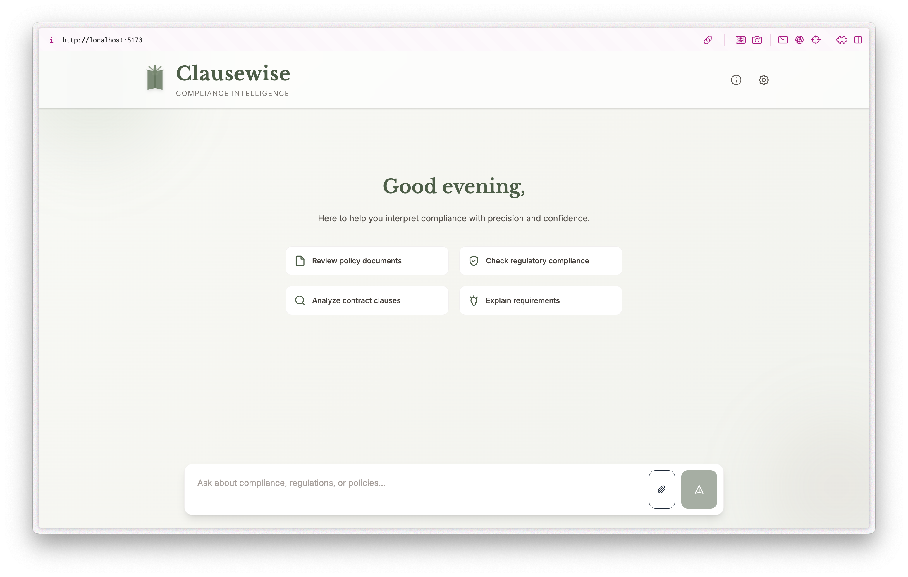

# Clausewise: An Azure AI Service Desk for Immigration Compliance

Clausewise is an AI-powered service desk assistant for immigration compliance that automates routine queries while gracefully escalating complex cases to human experts. Built by **Fatima Hejazi** and **Sharmaine Erika** for the **Microsoft Innovation Challenge 2025**.

## Overview

International Student Office (ISO) teams face a critical bottleneck: hundreds of routine questions weekly while complex cases requiring expert judgment sit in backlog. Students wait 3 to 7 days for simple eligibility answers.

Clausewise addresses this through a multi agent architecture that classifies intent, retrieves policy documents, validates evidence, generates explanations with citations, and escalates high stakes cases while maintaining full audit trails.

## Key Capabilities

* **Grounded Answers:**
  Responses rely on retrieved policy documents. The validator agent rejects any content not supported by source material.

* **Transparent Reasoning:**
  Every answer includes citations, source excerpts, and clear explanations of the system’s reasoning process.

* **Safe Escalation:**
  Low confidence queries and high stakes topics such as document discrepancies, visa denials, and legal edge cases automatically route to human experts with full conversation context.

* **Document Intelligence:**
  OCR powered analysis of PDFs, DOCX files, and scanned documents extracts structured content for policy interpretation.

* **Multilingual Support:**
  Guidance delivered in 90+ languages while maintaining legal precision and validation standards.

## Architecture

User queries flow through six specialized agents. Each agent operates independently with clear input and output contracts, making the system modular, testable, and maintainable.

<table style="border-collapse: collapse; width: 100%;">
  <tr>
    <th style="border: 1px solid #ccc; padding: 6px;">Agent</th>
    <th style="border: 1px solid #ccc; padding: 6px;">Purpose</th>
    <th style="border: 1px solid #ccc; padding: 6px;">Technology</th>
  </tr>
  <tr>
    <td style="border: 1px solid #ccc; padding: 6px;">Classifier</td>
    <td style="border: 1px solid #ccc; padding: 6px;">Intent recognition with confidence scoring</td>
    <td style="border: 1px solid #ccc; padding: 6px;">Azure OpenAI</td>
  </tr>
  <tr>
    <td style="border: 1px solid #ccc; padding: 6px;">Retriever</td>
    <td style="border: 1px solid #ccc; padding: 6px;">Policy document search (hybrid vector + keyword)</td>
    <td style="border: 1px solid #ccc; padding: 6px;">Azure Cognitive Search</td>
  </tr>
  <tr>
    <td style="border: 1px solid #ccc; padding: 6px;">Validator</td>
    <td style="border: 1px solid #ccc; padding: 6px;">Evidence grounding and PII redaction</td>
    <td style="border: 1px solid #ccc; padding: 6px;">Azure Document Intelligence + rules</td>
  </tr>
  <tr>
    <td style="border: 1px solid #ccc; padding: 6px;">Explainer</td>
    <td style="border: 1px solid #ccc; padding: 6px;">Structured answer generation with citations</td>
    <td style="border: 1px solid #ccc; padding: 6px;">Azure OpenAI</td>
  </tr>
  <tr>
    <td style="border: 1px solid #ccc; padding: 6px;">Escalation</td>
    <td style="border: 1px solid #ccc; padding: 6px;">Risk assessment and human handoff logic</td>
    <td style="border: 1px solid #ccc; padding: 6px;">Rule engine</td>
  </tr>
  <tr>
    <td style="border: 1px solid #ccc; padding: 6px;">Safety</td>
    <td style="border: 1px solid #ccc; padding: 6px;">Content filtering and bias detection</td>
    <td style="border: 1px solid #ccc; padding: 6px;">Azure Content Safety</td>
  </tr>
</table>

## Technology Stack

Clausewise leverages Azure AI services and modern web technologies to deliver accurate, transparent, and scalable compliance automation.

### Azure AI Services

* **Azure OpenAI (Foundry):**
  Powers intent classification, answer composition, multilingual reasoning, and policy aware explanations.

* **Azure Cognitive Search:**
  Hybrid search (vector embeddings + keyword matching) retrieves the most relevant policy excerpts.

* **Azure Document Intelligence:**
  Parses PDFs, DOCX files, and scanned documents into structured, searchable content.

* **Azure Content Safety:**
  Screens inputs and outputs for harmful content and performs risk detection.

* **Azure AI Translator:**
  Generates native language guidance while preserving legal meaning.

### Backend and Infrastructure

* **FastAPI:**
  API gateway and multi agent orchestrator.

* **Azure App Service:**
  Hosts the backend with auto scaling (1 to 10 instances based on demand).

* **Azure Front Door:**
  CDN and web application firewall for global distribution and DDoS protection.

* **Azure Blob Storage:**
  Secure storage for processed documents and audit logs.

* **Azure Key Vault:**
  Manages encryption keys and API secrets.

* **GitHub Actions:**
  CI/CD pipeline for automated testing and deployment.

### Frontend

* **React, TypeScript, Vite:**
  Clean, fast interface for queries, citations, and audit trail viewing.

## Responsible AI

Clausewise embodies responsible AI principles designed for high stakes compliance scenarios where accuracy, transparency, and safety are essential.

* **Grounding and Accuracy:**
  Answers must be backed by retrieved policy text. The validator agent rejects unsupported claims.

* **Safety and Escalation:**
  High risk topics such as document mismatches, legal ambiguities, and conflicting regulations trigger automatic escalation with full conversation context and a case ID.

* **Transparency:**
  Every decision includes citations, reasoning steps, and source excerpts. All interactions are logged for audit and review.

* **Privacy and Security:**
  PII is redacted before processing. Audit logs are encrypted at rest using Azure Key Vault. No personal data is retained beyond session scope.

* **Fairness and Language Equity:**
  Multilingual access ensures non native English speakers receive the same quality guidance. All languages pass through identical validation and safety checks.

## Performance Targets

The system is designed to meet production-grade performance standards for high-volume compliance workloads.

* **API Response Time:** <200ms (p95)
* **Document Processing:** <3s per page
* **Auto scaling:** 1 to 10 instances based on demand
* **Availability:** 99.9% SLA target

## Project Status

This repository demonstrates the core architecture and responsible AI mechanisms for automated compliance assistance. The multi agent system, escalation logic, and document intelligence capabilities are implemented and functional.

### Current Focus Areas

* Azure service integration and deployment configuration
* Voice interface support using Azure Speech Services
* Analytics dashboard for compliance tracking

### Future Roadmap

* Multi document comparison engine
* University system integrations for streamlined workflows
* Continuous refinement of escalation thresholds based on operational data

## Acknowledgments

We extend our gratitude to **Microsoft** for providing the platform and infrastructure that made this work possible, and to **Genspark** for their support throughout the challenge.

---

Built with ᥫ᭡ for the **Microsoft Innovation Challenge 2025**
